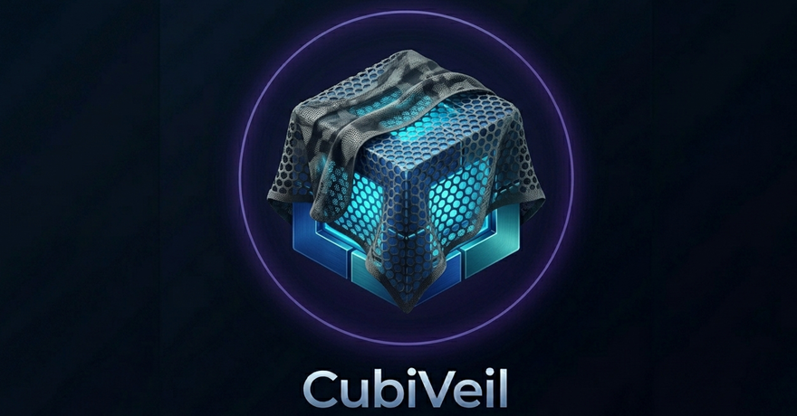

# CubiVeil

<p align="center">
  
</p>

<p align="center">
  <strong>Автоматизированная установка и управление Marzban + Sing-box</strong>
</p>

<p align="center">
  <a href="docs/README_EN.md">English version</a>
</p>

<p align="center">
  <a href="https://github.com/cubiculus/CubiVeil/actions/workflows/ci.yml"></a>
  <a href="https://opensource.org/licenses/MIT"></a>
  <a href="https://ubuntu.com/"></a>
  <a href="https://www.python.org/"></a>
  <a href="https://mypy.readthedocs.io/"></a>
  <a href="https://github.com/PyCQA/bandit"></a>
</p>

---

## 📋 О проекте

**CubiVeil** — это комплексное решение для развёртывания и управления инфраструктурой на базе **Marzban** и **Sing-box** на серверах Ubuntu.

Проект предоставляет:
- 🚀 Автоматическую установку всех компонентов
- 🔒 Настройку firewall, Fail2ban и SSL-сертификатов
- 📊 Мониторинг ресурсов и алерты
- 💾 Автоматическое резервное копирование
- 🤖 Telegram-бот для управления сервером
- 🛠 Набор утилит для обслуживания
- 🎭 Сайт-прикрытие с генерацией трафика (decoy-site)
- 🌐 Traffic shaping для уникального "почерка" сервера

## ⚡ Быстрый старт

### Установка

```bash
# Установка git (если не установлен)
sudo apt update && sudo apt install -y git

# Клонирование репозитория
git clone https://github.com/cubiculus/cubiveil.git
cd cubiveil

# Запуск установщика
sudo bash install.sh
```

Установщик автоматически:
1. Проверит окружение
2. Обновит систему
3. Настроит firewall и Fail2ban
4. Установит Sing-box и Marzban
5. Настроит SSL-сертификаты Let's Encrypt (порт 80 открывается автоматически)
6. Сгенерирует ключи и конфигурации

### Требования

- **ОС:** Ubuntu 20.04+
- **Права:** root (sudo)
- **Домен:** для панели и SSL-сертификатов
- **DNS:** A-запись домена на IP сервера
- **Порт 80:** должен быть открыт для получения SSL (открывается автоматически)

### Dev-режим (для тестирования)

Для установки на тестовую виртуальную машину без домена:

```bash
sudo bash install.sh --dev
```

**Dev-режим:**
- ✅ Не требует домен
- ✅ Использует самоподписной SSL сертификат (действует 100 лет)
- ✅ Не проверяет DNS A-записи
- ✅ Идеально для тестирования и разработки
- ⚠️ Браузеры будут показывать предупреждение о безопасности
- ⚠️ Не используйте в production!

### Dry-run режим (симуляция)

Для тестирования установщика без внесения изменений в систему:

```bash
sudo bash install.sh --dry-run
```

**Dry-run режим:**
- ✅ Не вносит никаких изменений в систему
- ✅ Показывает все шаги которые будут выполнены
- ✅ Проверяет окружение и зависимости
- ✅ Безопасно запускать на любой системе
- ✅ Можно комбинировать с `--dev`

**Комбинирование режимов:**

```bash
# Dev + Dry-run: проверить dev-установку без изменений
sudo bash install.sh --dev --dry-run
```

**С опциями:**

```bash
# Dev-режим с кастомным доменом
sudo bash install.sh --dev --domain=mytest.local

# Показать справку
sudo bash install.sh --help

# Режим отладки (подробный вывод + DEBUG логи)
sudo bash install.sh --debug

# Режим отладки + симуляция (без изменений в системе)
sudo bash install.sh --debug --dry-run

# Режим отладки + dev-режим (тестирование с подробным выводом)
sudo bash install.sh --debug --dev

# Пропустить установку сайта-прикрытия
sudo bash install.sh --no-decoy

# Пропустить модуль Traffic Shaping
sudo bash install.sh --no-traffic-shaping

# Установить Telegram-бот (интерактивная настройка)
sudo bash install.sh --telegram

# Сохранить лог установки
sudo bash install.sh --debug 2>&1 | tee install_debug.log
```

**Все параметры:**

| Параметр | Описание |
|----------|----------|
| `--dev` | Dev-режим: самоподписной SSL, не требуется домен |
| `--dry-run` | Симуляция установки без изменений в системе |
| `--debug`, `-v` | Режим отладки: подробный вывод + DEBUG логи |
| `--domain=NAME` | Установить домен (по умолчанию в dev: dev.cubiveil.local) |
| `--no-decoy` | Пропустить установку сайта-прикрытия |
| `--no-traffic-shaping` | Пропустить модуль Traffic Shaping |
| `--telegram` | Установить Telegram-бот |
| `--help`, `-h` | Показать справку |

## 📦 Компоненты

### Основные

| Компонент | Описание |
|-----------|----------|
| **Marzban** | Панель управления пользователями и подписками |
| **Sing-box** | Ядро с поддержкой современных протоколов |
| **Fail2ban** | Защита от брутфорс-атак |
| **UFW** | Межсетевой экран |
| **Let's Encrypt** | SSL-сертификаты |
| **Decoy Site** | Сайт-прикрытие с генерацией реалистичного трафика |
| **Traffic Shaping** | Управление сетевыми параметрами для уникального "почерка" |

### 🎭 Сайт-прикрытие (Decoy Site)

Сайт-прикрытие имитирует активный веб-сервис с реалистичным трафиком:

**Генерация файлов при установке:**
- **JPG изображения:** 3-5 шт (5-20 MB каждый)
- **PDF документы:** 1-2 шт (50-200 MB каждый)
- **MP4 видео:** 1 шт (100-300 MB)
- **MP3 аудио:** 1 шт (10-50 MB)
- **Вспомогательные:** robots.txt, sitemap.xml, favicon.ico

**Ротация файлов:**
- Запускается автоматически каждые 3 часа (настраивается)
- Каждый цикл заменяет 1 случайный файл на новый
- Тип файла выбирается на основе весов: JPG (4), PDF (2), MP4 (1)
- Старые файлы удаляются по времени модификации
- Лимит размера: 5000 MB (настраивается в `/etc/cubiveil/decoy.json`)

**Конфигурация ротации** (`/etc/cubiveil/decoy.json`):
```json
{
  "rotation": {
    "enabled": true,
    "interval_hours": 3,
    "files_per_cycle": 1,
    "types": {
      "jpg": { "enabled": true, "weight": 4 },
      "pdf": { "enabled": true, "weight": 2 },
      "mp4": { "enabled": true, "weight": 1 },
      "mp3": { "enabled": false, "weight": 1 }
    }
  },
  "max_total_files_mb": 5000
}
```

### Утилиты

Все утилиты находятся в директории `utils/`:

| Утилита | Описание |
|---------|----------|
| `cubiveil.sh` | CLI-менеджер (единая точка входа) |
| `monitor.sh` | Мониторинг ресурсов сервера |
| `backup.sh` | Создание и восстановление бэкапов |
| `diagnose.sh` | Диагностика проблем |
| `manage-profiles.sh` | Управление профилями пользователей |
| `export-config.sh` | Экспорт конфигурации для миграции |
| `update.sh` | Обновление CubiVeil |
| `rollback.sh` | Откат к предыдущей версии |

#### Установка алиасов

Для удобного доступа к утилитам:

```bash
sudo bash utils/install-aliases.sh
source /root/.bashrc
```

После установки доступны команды:
- `cv` — справка
- `cv monitor` — мониторинг
- `cv backup create` — создать бэкап
- `cv profiles list` — список профилей
- `cv diagnose` — диагностика

## 🤖 Telegram-бот

CubiVeil Bot предоставляет полный контроль над сервером через Telegram.

### Установка бота

```bash
bash setup-telegram.sh
```

### Основные команды

#### Мониторинг
- `/status` — краткий статус сервера
- `/monitor` — полный снимок состояния
- `/services` — статус всех сервисов
- `/alerts` — статус алертов и порогов

#### Бэкапы
- `/backup` — создать полный бэкап
- `/backups` — список доступных бэкапов

#### Пользователи
- `/users` — список всех пользователей
- `/qr <username>` — QR-код для подключения
- `/traffic <username>` — расход трафика
- `/subscription <username>` — ссылка на подписку

#### Управление
- `/restart <service>` — перезапустить сервис
- `/update` — проверить обновления
- `/export` — экспорт конфигурации
- `/diagnose` — полная диагностика
- `/enable <username>` — включить профиль
- `/disable <username>` — отключить профиль
- `/extend <username> <days>` — продлить профиль
- `/reset <username>` — сбросить трафик
- `/create <username>` — создать новый профиль

#### Логи
- `/logs <service> [lines]` — логи сервиса

Подробная документация: [BOT_INTEGRATION.md](BOT_INTEGRATION.md)

## 📊 Автоматизация

### Ежедневные отчёты

Бот автоматически отправляет отчёты в заданное время (по умолчанию 09:00 UTC):
- Загрузка CPU, RAM, диска
- Uptime сервера
- Количество активных пользователей
- Бэкап базы данных

### Алерты

Автоматические уведомления при превышении порогов:
- **CPU:** 80% (настраивается)
- **RAM:** 85% (настраивается)
- **Disk:** 90% (настраивается)

Проверка каждые 15 минут. Алерт отправляется только при переходе из нормы в превышение.

## 🔧 Конфигурация

### Локализация

Проект поддерживает русский и английский языки. Переключение в `lang/main.sh`.

### Переменные окружения

Настройки бота задаются через systemd Environment:
- `TG_TOKEN` — токен Telegram-бота
- `TG_CHAT_ID` — авторизованный chat_id
- `ALERT_CPU`, `ALERT_RAM`, `ALERT_DISK` — пороги алертов

## 🛡 Безопасность

### Ограничения бота

Systemd-сервис бота имеет ограничения:
- `ProtectHome=true` — нет доступа к домашним директориям
- `ProtectSystem=strict` — только чтение системных файлов
- `NoNewPrivileges=true` — нет дополнительных привилегий
- `ReadWritePaths` — запись только в `/opt/cubiveil-bot/`

### Авторизация

Бот принимает команды только от авторизованного `CHAT_ID`.

### Шифрование бэкапов

Утилиты поддерживают шифрование через `age`. Для зашифрованных бэкапов используйте SSH.

## 📁 Структура проекта

```
cubiveil/
├── assets/
│   ├── logo.png
│   └── telegram-bot/
│       ├── bot.py
│       ├── commands.py
│       ├── metrics.py
│       └── ...
├── lang/
│   ├── main.sh           # Основная локализация (EN/RU)
│   └── telegram.sh       # Локализация Telegram-бота
├── lib/
│   ├── core/
│   │   ├── installer/        # Модули установщика (новая архитектура)
│   │   │   ├── bootstrap.sh  # Загрузка файлов репозитория
│   │   │   ├── cli.sh        # Разбор аргументов командной строки
│   │   │   ├── orchestrator.sh # Оркестрация установки модулей
│   │   │   ├── prompt.sh     # Интерактивные prompts
│   │   │   └── ui.sh         # UI функции (баннер, отчёты)
│   │   ├── log.sh        # Логирование с поддержкой локализации
│   │   └── system.sh     # Системные функции
│   ├── modules/
│   │   ├── backup/           # Резервное копирование
│   │   ├── decoy-site/       # Сайт-прикрытие
│   │   ├── fail2ban/         # Fail2ban
│   │   ├── firewall/         # UFW firewall
│   │   ├── marzban/          # Marzban панель
│   │   ├── monitoring/       # Мониторинг ресурсов
│   │   ├── rollback/         # Откат версий
│   │   ├── singbox/          # Sing-box ядро
│   │   ├── ssl/              # SSL сертификаты (Let's Encrypt)
│   │   ├── system/           # Системный модуль
│   │   └── traffic-shaping/  # Traffic shaping
│   ├── common.sh         # Общие функции
│   ├── fallback.sh       # Fallback функции
│   ├── i18n.sh           # Интернационализация API
│   ├── output.sh         # Функции вывода (единый стиль)
│   ├── security.sh       # Функции безопасности
│   ├── utils.sh          # Утилиты
│   └── validation.sh     # Валидация данных
├── utils/
│   ├── cubiveil.sh           # CLI-менеджер
│   ├── install-aliases.sh    # Установка алиасов
│   ├── update.sh             # Обновление CubiVeil
│   ├── rollback.sh           # Откат версии
│   ├── export-config.sh      # Экспорт конфигурации
│   ├── import-config.sh      # Импорт конфигурации
│   ├── monitor.sh            # Мониторинг ресурсов
│   ├── diagnose.sh           # Диагностика проблем
│   ├── manage-profiles.sh    # Управление профилями
│   ├── backup.sh             # Бэкапы
│   └── README.md
├── tests/
│   ├── unit-lang.sh          # Тесты локализации
│   ├── unit-install.sh       # Тесты установщика
│   ├── unit-telegram.sh      # Тесты Telegram-бота
│   └── ...
├── docs/
│   ├── README_EN.md          # English documentation
│   └── ...
├── .github/workflows/
│   └── ci.yml                # CI/CD pipeline
├── install.sh                # Основной установщик
├── setup-telegram.sh         # Установка Telegram-бота
├── run-tests.sh              # Запуск тестов
├── .pre-commit-config.yaml   # Pre-commit hooks
└── README.md                 # Документация (RU)
```

## 🧪 Тестирование

Запуск тестов:

```bash
bash run-tests.sh
```

CI/CD включает проверки:
- **Shellcheck** — статический анализ bash-скриптов
- **shfmt** — форматирование кода
- **bash -n** — проверка синтаксиса
- **Mypy** — проверка типов Python
- **Bandit** — анализ безопасности Python

## 🔧 Устранение неполадок

### Бот не отвечает

```bash
# Проверка статуса
systemctl status cubiveil-bot

# Перезапуск
systemctl restart cubiveil-bot

# Просмотр логов
journalctl -u cubiveil-bot -n 50
```

### Утилиты не выполняются

```bash
# Проверка путей
ls -la /opt/cubiveil/utils/

# Проверка прав
chmod +x /opt/cubiveil/utils/*.sh
```

### Проблемы с SSL

Убедитесь, что:
- A-запись домена указывает на IP сервера
- Порт 80/443 открыт в firewall
- Домен не внутренний (не localhost, не .local)

## 📄 Документация

- [Интеграция Telegram-бота](BOT_INTEGRATION.md)
- [Утилиты CubiVeil](utils/README.md)
- [Английская версия README](docs/README_EN.md)

## 🤝 Вклад в проект

1. Fork репозитория
2. Создайте feature-ветку (`git checkout -b feature/amazing-feature`)
3. Commit изменения (`git commit -m 'Add amazing feature'`)
4. Push в ветку (`git push origin feature/amazing-feature`)
5. Откройте Pull Request

### Pre-commit хуки

Проект использует pre-commit для автоматических проверок перед коммитом:

```bash
# Установка зависимостей
pip install pre-commit detect-secrets

# Активация хуков
pre-commit install
```

**Что проверяется:**
- 🔐 Пароли, API-ключи, токены (detect-secrets)
- 🔐 Приватные ключи SSH/GPG/SSL
- 🐛 Синтаксис Bash-скриптов (shellcheck)
- 📦 Файлы >1MB блокируются

**Опционально (для полной защиты):**
```bash
# Установка trufflehog для проверки истории Git
# Linux/MacOS:
go install github.com/trufflesecurity/trufflehog/v3@latest

# Ручная проверка истории:
trufflehog git file://. --only-verified --fail
```

**Первичное сканирование на секреты:**
```bash
detect-secrets scan --baseline .secrets.baseline
```

> **Примечание для Windows:** shellcheck может иметь проблемы с кодировкой файлов. Для исправления конвертируйте файлы в Unix LF: `tr -d '\r' < file.sh > file.tmp`

## 📝 Лицензия

MIT License — см. файл [LICENSE](LICENSE)

## 👤 Автор

**cubiculus** — [GitHub](https://github.com/cubiculus/cubiveil)

---

<p align="center">
  <strong>CubiVeil</strong> |
  <a href="docs/README_EN.md">English</a> |
  <a href="https://github.com/cubiculus/cubiveil">GitHub</a>
</p>
